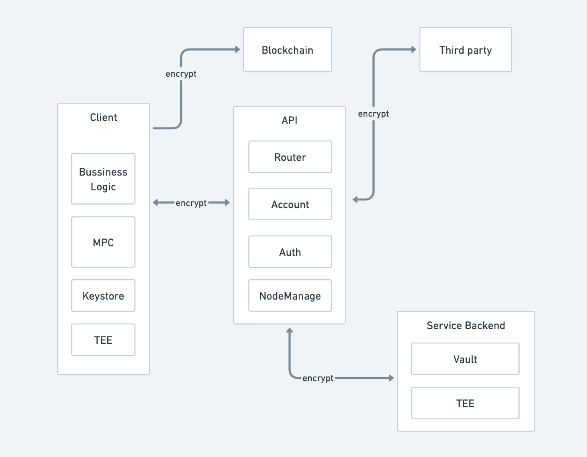

# CMP DEMO


```bash 
$> cd lib/multi-party-sig-cmp && go mod download # multi-party-sig-cmp 依赖安装
$> cd ../.. && go mod download # cmp依赖安装
```

在文件夹中已经生成了三个钱包`w1.kgc,w2.kgc,w3.kgc`，可以直接使用，地址是`0x41351a1f66808ee630b73a01f68d11eb639bf0f9`。也可以通过`create`来生成新的钱包。

## 命令

首先需要创建一个消息转发服务，打开一个新的终端，运行`go run main.go serve`，在过程中不关闭该终端。

接下来打开多个终端，分别代表不同的钱包。

### 创建钱包

  - 打开三个终端，运行下面命令，代表创建三个分片钱包
  - go run main.go create -w <wallet_path> -i <party_id> -s <party_ids> -t <threshold>
  - 比如 `go run main.go create -w w{n}.kgc -i {n} -s 1,2,3 -t 2`
  
### 转账

这一步需要有一个客户端，三个钱包节点。客户端发送交易给三个钱包节点签名，完成之后，客户端拿到签名结果发送交易上链。

首先启动三个节点，打开三个终端，运行`go run main.go node -w w{n}.kgc`。

然后运行下面命令，发送交易。
  
  - go run main.go transfer -w <wallet_path> -d <dist_address>
  - 比如 `go run main.go -w w1.kgc` ，会有一个默认目标地址,`0x921B004dc386ba15604bB97205Bb20988192DEDf`

## 架构



